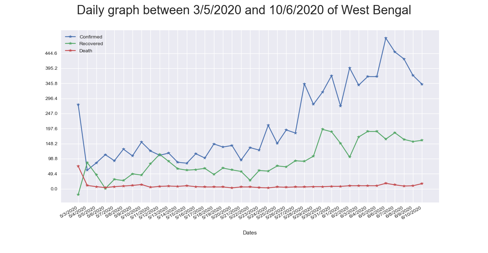

# covdata.covidindia Module

**Description**

This covidindia Module has the power to bring all the data related to Covid-19 outbreak in India in a tabular form. This module will bring the whole set of raw data in a date-wise and processed format from [the COVID-19 Indian Dataset maintained by University of Kalyani](https://github.com/kalyaniuniversity/COVID-19-Datasets), which will be easier to deal with.

Once installed, we can get an up-to-date information about the Covid-19 affected people, till the day the data is available at the source. We can visualize the data of our choice for any given range of dates. It is capable of giving information about the total number of confirmed, recovered and deceased patients, between any two dates, of any city, district or related to any particular gender (male/female). We can also visualize the whole up-to-date data without using any aforesaid filters using our module.

# How it works?

It gathers information from our own maintained database. Database data are collected from various websites, news channels and [covid19india.org crowdsourcing initiative](https://www.covid19india.org). From the collected data this module will help user to represent in user friendly format with all types of filters in one place. No need to search any website. Just use this module for India based Covid-19 projects.

## Installation

     pip install covdata

## What's new!!

- District wise data for each state with daily basis is available now.
- Number of subject tested data for every state with daily basis is now availabe.
- All types of graphs can be separately generated as confirmed,deceased or recovered. No more subplots will be generated.
- With all graphs data new extra data can be pushed to generate multiple line graphs to track the any relevance information.This extra data must be a dictionary or list of dictionary where for each dictionary contains a list of data points with a suitable key name.This key name will the legend name of the garph.

## Up the server

     covdata cov-server   #to start the server with default port
     covdata cov-server -b :8000      #to bind the port at 8000

## Usage

     #import module
     from covdata.covidindia import initializer,Demographic_overview,Data,visualizer

     #Initialize the module to collect the data
     Init=initializer()

     #shows the collected data in Dataframe format of Total Confimed data as daily count basis. If daily is not mentioned cumulative data will be shown.

     Init.show_data(of='Total Confirmed',daily=True)

     obj1=Data(init)       #defining the object for Data class
     cumData=obj1.get_cum_dataset_between_date('30/1/2020','5/4/2020',by='total recovered')   #gives the cumulative count between 30/1/2020 and 5/4/2020

     obj1.rank(10,'Total Confirmed',kind='top',cummulative=True,date='4/3/2020')   #gives the top 10 total confirmed cases for date 4/3/2020

     obj2=Demographic_overview(init)     # object for demographic_overview class

     obj2.demography('Salt Lake','30/1/2020-10/4/2020')    #Gives Male and Female counts of confirmed cases for salt lake city in west bengal between 30/1/2020 and 10/4/2020

     obj3=visualizer(init)       #initiazing visualizer class

     obj3.whole(daily=True)       #shows line plot for daily counts of confirmed cases,recovered cases and death cases against date.

## Examples

Examples are in [github](https://github.com/kalyaniuniversity/covidindia) repository project folder.

A website has been created that will show the required data of Covid-19 in india and some graphs are added.From that website each and every single data can de downloaded.

See [covdataserver](https://covdata.pythonanywhere.com/)

## Documentation

All methods are described under [wiki](https://github.com/kalyaniuniversity/covidindia/wiki) page.

## Terminal Usage

See [Terminal Usage Wiki page](https://github.com/kalyaniuniversity/covidindia/wiki/Terminal-Usage) for details

## Sample Graph

## Documentation

Help on module covidindia:

NAME
covidindia - Created on Tue Mar 31 15:24:51 2020

DESCRIPTION
@author: Dripta

CLASSES
builtins.object
initializer
Data
Demographic_overview
visualizer

    class Data(initializer)
     |  Data(init)
     |
     |  # Data class can apply various filters on collected datasets(Confirmed,Recovered,Deceased)
     |  # based on User's choice
     |
     |  Method resolution order:
     |      Data
     |      initializer
     |      builtins.object
     |
     |  Methods defined here:
     |
     |  __init__(self, init)
     |      This is a class that will scrap the data from source upto the previous day of
     |      day of using that package.
     |
     |      Returns
     |      -------
     |      None.
     |
     |  get_count_between_date(self, startDate, endDate, by)
     |      Gives daily count data for all states between two dates
     |
     |      Parameters
     |      ----------
     |      startDate : character
     |          date format dd/mm/yyyy
     |      endDate : character
     |          date format dd/mm/yyyy.
     |      by : character
     |          'Confirmed' or 'Recovered' or 'Death'.
     |
     |      Raises
     |      ------
     |      Exception
     |          Startdate must be less than enddate.If not it raise anexception.
     |          it also raise error for wrong input in by parameter.
     |
     |      Returns
     |      -------
     |      df : DataFrame
     |          DataFrame consisting daily counts for between two given dates
     |          for given by parameter.
     |
     |  get_count_by_date(self, by, date=None)
     |      Gives the daily count of a given date or all dates by 'confirmed' or 'recovered'
     |      or 'death'
     |
     |      Parameters
     |      ----------
     |      by : character
     |          'Confirmed' or 'Recovered' or 'Death'.
     |      date : character, optional
     |          if date(dd/mm/yyyy) is given count will be shown for that date. The default is None.
     |
     |      Raises
     |      ------
     |      Exception
     |          If by argument is not within above mentioned and if year is not 2020 it will
     |          raise an exception.
     |
     |      Returns
     |      -------
     |      df : dataframe
     |          dataframe consisting of counts of given date or all dates for all states .
     |
     |  get_cum_dataset_between_date(self, startDate, endDate, by)
     |      This method of Data class will give cumulative counts between two given dates
     |      for all states
     |
     |      Parameters
     |      ----------
     |      startDate : character
     |          date format dd/mm/yyyy.
     |      endDate : character
     |          date format dd/mm/yyyy.
     |      by : character
     |          'Total Confirmed' or 'Total Recovered' or 'Total Death'.
     |
     |      Raises
     |      ------
     |      Exception
     |          startdate should be less than endDate---if not it will raise exception.
     |
     |      Returns
     |      -------
     |      df : Dataframe
     |          returns a dataframe of cumulative counts between two dates for all states by
     |          'Total Confirmed' or 'Total Recovered' or 'Total Death'.
     |
     |  get_dataset_by_date(self, date)
     |      This method of Data Class will allow user to get cumulative count of all states of
     |      total confirmed,total death and total recovered
     |      India for a particular given date
     |
     |      Parameters
     |      ----------
     |      date : character
     |          Should be in dd/mm/yyyy format.
     |
     |      Returns
     |      -------
     |      df : Dataframe
     |          Dataframe consisting all cumulative values of total confirmed,total recovered,total
     |          death for a given date.
     |
     |  get_dataset_state(self, state='Whole', daily=False)
     |      this method of Data class will allow user to get cumulative counts of a particular
     |      state.
     |
     |      Parameters
     |      ----------
     |      state : character, optional
     |          name of state in India. The default is 'Whole'.
     |          state code is also applicable.If not given data for all states will be shown.
     |      daily : bool, optional
     |          If True Daily Count data will be shown. The default is False.
     |
     |      Raises
     |      ------
     |      Exception
     |          If state/state code is wrong it will raise exception.
     |
     |      Returns
     |      -------
     |      df : DataFrame
     |          if state is whole and daily is Flase then it Returns a dataframe consisting all states having
     |          daily death.
     |
     |          confirmed data.
     |
     |  get_district_data_by_date(self, place, date='All')
     |      Gives the district wise data for a state or for a given district and any given date.
     |
     |      Parameters
     |      ----------
     |      place : character
     |          name of a district or a state(state code also applicable)
     |      date : character, optional
     |          date format(dd/mm/yyyy) for which data will be retrieved. The default is 'All'.
     |
     |      Raises
     |      ------
     |      Exception
     |          If place is wrong or maybe if data is not available for that place exception will be raised.
     |          If date is wrong or if data is unavailable for that date exception will be raised.
     |
     |      Returns
     |      -------
     |      TYPE
     |          Dataframe.
     |
     |  rank(self, num, by, kind='top', cumulative=False, date=None)
     |      Gives top n or bottom n values as cumulative or daily basis for a date or
     |      combining whole dates filtered with by parameter.
     |
     |      Parameters
     |      ----------
     |      num : integer
     |          number of rows user want to see.
     |          e.g num=10 -> top/bottom 10 data will be shown
     |      by : character
     |          'Total Confirmed' or 'Total Recovered' or 'Total Death'.
     |      kind : character, optional
     |          'top' or 'bottom' by which data will be filtered. The default is 'top'.
     |      cummulative : bool, optional
     |         if True it will show cumulative counts. The default is False.
     |      date : character, optional
     |          (must be in dd/mm/yyyy format)if date is given then method will return cumulative or daily count
     |          for that date. The default is None.
     |          if None it will return all cumulative/daily counts
     |
     |      Raises
     |      ------
     |      Exception
     |          if date is None and cumulative is false then it is not possible to show
     |          data for top n or botom n rows..
     |
     |      Returns
     |      -------
     |      dataframe/dictionary
     |          if date is not given and cummulative is False then it prompt to input state(state code or name)
     |          if state is set to 'all' it will return dictionary consisting all states having top/bottom counts
     |          otherwise a dataframe for a given state.
     |          whenever date is mentioned a dataframe will be returned consisting top/bottom cumulative count or
     |          daily count for that date.
     |
     |  tested_subject_data(self, date=None, state=None)
     |      Gives the data on the number of subjetcs are tested for corona infection
     |      for different states with date.
     |
     |      Parameters
     |      ----------
     |      date : string, optional
     |          date for which tests data will be displayed.Date may be a single date or range
     |          of dates separated by "-"(dd/mm/yyyy).(e.g. "2/05/2020-7/05/2020").If date is not
     |          mentioned data for all date will be shown. The default is None.
     |      state : string, optional
     |          For which state data will be shown.State may be a name or state code.If not mentioned
     |          data for all states will be shown. The default is None.
     |
     |      Raises
     |      ------
     |      Exception
     |          For wrong state and wrong date or if data is not found for a particular date exception
     |          will be thrown.
     |
     |      Returns
     |      -------
     |      Dataframe
     |          DataFrame having required data as mentioned by user.
     |
     |  ----------------------------------------------------------------------
     |  Methods inherited from initializer:
     |
     |  show_data(self, of, daily=False)
     |      This method only assembles the collected data
     |
     |      Returns
     |      -------
     |      list
     |          returns collected data as 3 dataframe format.
     |
     |  ----------------------------------------------------------------------
     |  Data descriptors inherited from initializer:
     |
     |  __dict__
     |      dictionary for instance variables (if defined)
     |
     |  __weakref__
     |      list of weak references to the object (if defined)

    class Demographic_overview(initializer)
     |  Demographic_overview(init, silent=False)
     |
     |  Method resolution order:
     |      Demographic_overview
     |      initializer
     |      builtins.object
     |
     |  Methods defined here:
     |
     |  __init__(self, init, silent=False)
     |      This Demographic_overview class has the power of filtering in terms of state,
     |      district,city,date or range of date
     |
     |      Returns
     |      -------
     |      None.
     |
     |  demography(self, place='all', date='all')
     |      This method can show the male and female count of confirmed cases for a state or a district or
     |      a city for a given date of range of date.
     |
     |      Parameters
     |      ----------
     |      place : character, optional
     |          place can be state or district or city.this method automatically recognize the place
     |          and gives user data for that place. The default is 'all'.If place is mentioned data for all places
     |          will be shown.
     |      date : character, optional
     |          by which date or range of date the data will be filtered.Date must be dd/mm/yyyy format.
     |          The default is 'all'.if date is not mentioned data for all dates will be shown
     |
     |      Raises
     |      ------
     |      Exception
     |          If no data is found for a date or a place it will raise exceptions.
     |
     |      Returns
     |      -------
     |      Dataframe
     |          dataframe consists of male female counts of confirmed cases for given date and place.
     |
     |  ----------------------------------------------------------------------
     |  Methods inherited from initializer:
     |
     |  show_data(self, of, daily=False)
     |      This method only assembles the collected data
     |
     |      Returns
     |      -------
     |      list
     |          returns collected data as 3 dataframe format.
     |
     |  ----------------------------------------------------------------------
     |  Data descriptors inherited from initializer:
     |
     |  __dict__
     |      dictionary for instance variables (if defined)
     |
     |  __weakref__
     |      list of weak references to the object (if defined)

    class initializer(builtins.object)
     |  initializer(silent=False)
     |
     |  Methods defined here:
     |
     |  __init__(self, silent=False)
     |      This is a class that will scrap the data from source upto the previous day of
     |      day of using that package.
     |
     |      Returns
     |      -------
     |      None.
     |
     |  show_data(self, of, daily=False)
     |      This method only assembles the collected data
     |
     |      Returns
     |      -------
     |      list
     |          returns collected data as 3 dataframe format.
     |
     |  ----------------------------------------------------------------------
     |  Data descriptors defined here:
     |
     |  __dict__
     |      dictionary for instance variables (if defined)
     |
     |  __weakref__
     |      list of weak references to the object (if defined)

    class visualizer(initializer)
     |  visualizer(init)
     |
     |  Method resolution order:
     |      visualizer
     |      initializer
     |      builtins.object
     |
     |  Methods defined here:
     |
     |  __init__(self, init)
     |      Gather all information to perform the visualization
     |
     |      Parameters
     |      ----------
     |      init : TYPE
     |          None.
     |
     |      Returns
     |      -------
     |      None.
     |
     |  graph_by_date(self, startDate, endDate, typeof='together', state=None, title=None, daily=False, extdata=None)
     |      Gives the visualization of cumulative data or daily data between two given
     |      dates for a given state or as whole india.
     |
     |      Parameters
     |      ----------
     |      startDate : character
     |          dd/mm/yyyy format(e.g 02/04/2020).
     |      endDate : character
     |          dd/mm/yyyy format(e.g 02/04/2020).
     |      typeof : character, optional
     |          the data options that are used to plot(confirmed/recovered/death). The default is 'together'.
     |          set 'together' to generate multiple line chart.
     |      state : character, optional
     |          For which state plots will be generated.State code is also applicable. The default is None.
     |          if None the total data for all states will be plotted.
     |      title :  Character, optional
     |          Sets the title of the subplots. The default is None.
     |      daily : bool, optional
     |          if True garph will be plotted on daily counts otherwise on cumulative counts. The default is False.
     |      extdata : list or dict, optional
     |          data that will also be plotted with that particular plot.For one data that should be
     |          a dictionary containing a key and a list corresponding to that key.This key name is set as
     |          legend name for that list.For more that one list extdata should be list of dict.The default is None.
     |
     |      Raises
     |      ------
     |      Exception
     |          startdate must be less than enddate and if states are given wrong it will raise exception..
     |
     |      Returns
     |      -------
     |      matplotlib chart.
     |
     |  head(self, num, title=None, daily=False, typeof='together', state=None, extdata=None)
     |      Generate plot for the first <no of days> for confirmed/recovered/death data
     |
     |      Parameters
     |      ----------
     |      num : integer
     |          Last Number of days that is to be plotted.
     |      state : character, optional
     |          For which state plots will be generated.State code is also applicable. The default is None.
     |          if None the total data for all states will be plotted.
     |      title : Character, optional
     |          Sets the title of the subplots. The default is None.
     |      daily : bool, optional
     |          if True garph will be plotted on daily counts otherwise on cumulative counts. The default is False.
     |      typeof : character, optional
     |          the data options that are used to plot(confirmed/recovered/death). The default is 'together'.
     |          set 'together' to generate multiple line chart.
     |      extdata : list or dict, optional
     |          data that will also be plotted with that particular plot.For one data that should be
     |          a dictionary containing a key and a list corresponding to that key.This key name is set as
     |          legend name for that list.For more that one list extdata should be list of dict.The default is None.
     |
     |      Raises
     |      ------
     |      Exception
     |          If states code is wrong,extdata is not a list / dict then error will be raised..
     |
     |      Returns
     |      -------
     |      matplotlib chart.
     |
     |  tail(self, num, state=None, title=None, daily=False, typeof='together', extdata=None)
     |      Generate a plot using last <no of days> confirmed/recovered/death data.
     |
     |      Parameters
     |      ----------
     |      num : integer
     |          Last Number of days that is to be plotted.
     |      state : character, optional
     |          For which state plots will be generated.State code is also applicable. The default is None.
     |          if None the total data for all states will be plotted.
     |      title : Character, optional
     |          Sets the title of the subplots. The default is None.
     |      daily : bool, optional
     |          if True garph will be plotted on daily counts otherwise on cumulative counts. The default is False.
     |      typeof : character, optional
     |          the data options that are used to plot(confirmed/recovered/death). The default is 'together'.
     |          set 'together' to generate multiple line chart.
     |      extdata : list or dict, optional
     |          data that will also be plotted with that particular plot.For one data that should be
     |          a dictionary containing a key and a list corresponding to that key.This key name is set as
     |          legend name for that list.For more that one list extdata should be list of dict.The default is None.
     |
     |      Raises
     |      ------
     |      Exception
     |          If states code is wrong,extdata is not a list / dict then error will be raised..
     |
     |      Returns
     |      -------
     |      matplotlib chart.
     |
     |  whole(self, title=None, daily=False, typeof='together', state=None, extdata=None)
     |      Generate a plot using all confirmed/recovered/death data till now.
     |
     |      Parameters
     |      ----------
     |      title : Character, optional
     |          Sets the title of the subplots. The default is None.
     |      daily : bool, optional
     |          if True garph will be plotted on daily counts otherwise on cumulative counts. The default is False.
     |      typeof : character, optional
     |          the data options that are used to plot(confirmed/recovered/death). The default is 'together'.
     |          set 'together' to generate multiple line chart.
     |      state : character, optional
     |          For which state plots will be generated.State code is also applicable. The default is None.
     |          if None the total data for all states will be plotted.
     |      extdata : list or dict, optional
     |          data that will also be plotted with that particular plot.For one data that should be
     |          a dictionary containing a key and a list corresponding to that key.This key name is set as
     |          legend name for that list.For more that one list extdata should be list of dict.The default is None.
     |
     |      Raises
     |      ------
     |      Exception
     |          If states code is wrong,extdata is not a list / dict then error will be raised.
     |
     |      Returns
     |      -------
     |      matplotlib chart.
     |
     |  ----------------------------------------------------------------------
     |  Methods inherited from initializer:
     |
     |  show_data(self, of, daily=False)
     |      This method only assembles the collected data
     |
     |      Returns
     |      -------
     |      list
     |          returns collected data as 3 dataframe format.
     |
     |  ----------------------------------------------------------------------
     |  Data descriptors inherited from initializer:
     |
     |  __dict__
     |      dictionary for instance variables (if defined)
     |
     |  __weakref__
     |      list of weak references to the object (if defined)
